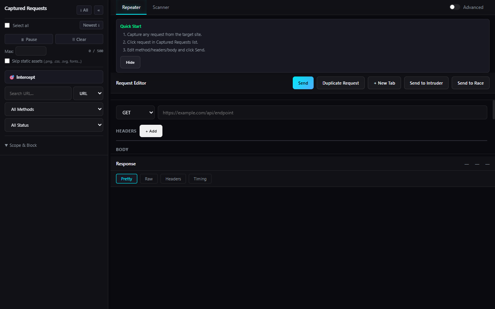
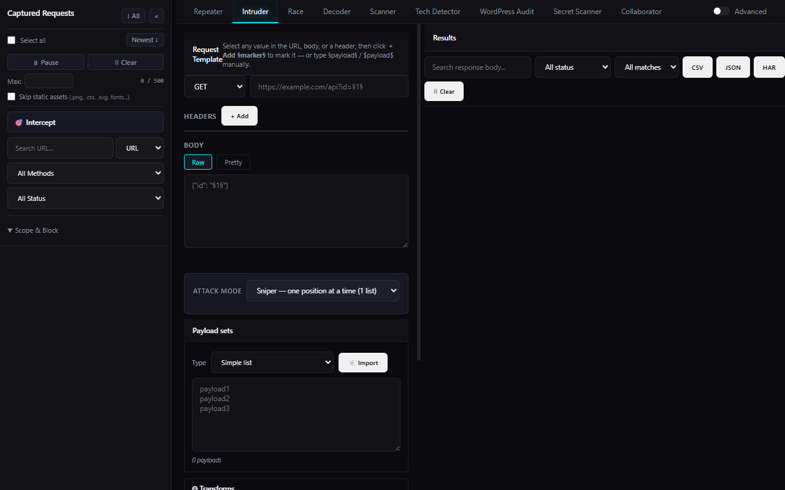
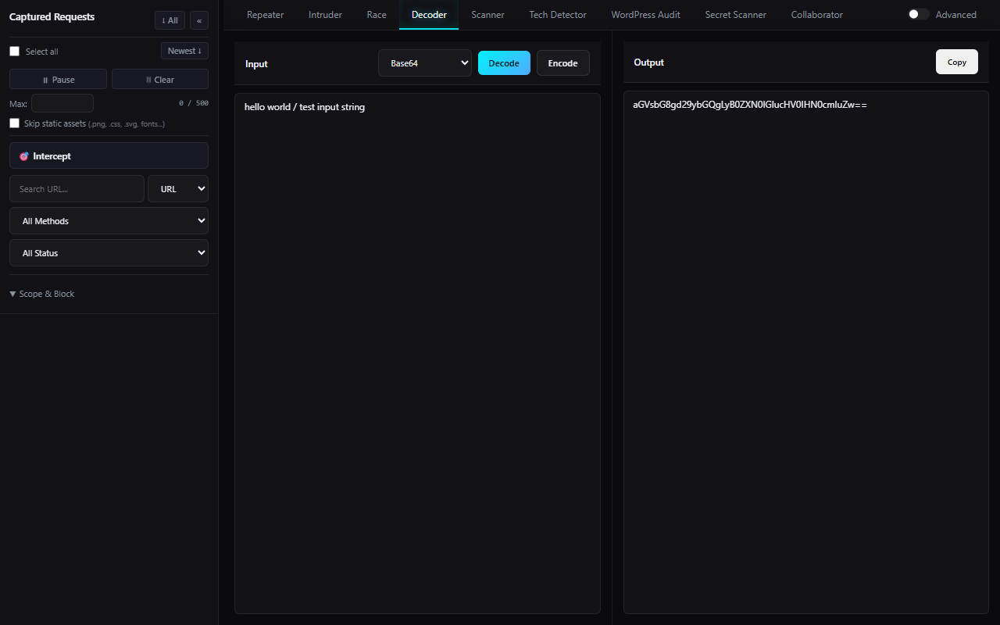

#  BurpLite 🚀

A modern Chrome & Firefox DevTools Extension for penetration testing, security auditing, and request tampering. 

**Developed by: JOJIN JOHN**

🔗 **Official Website**: [jojin1709.github.io/BurpLite/](https://jojin1709.github.io/BurpLite/)
🦊 **Firefox Add-on Store**: [addons.mozilla.org/firefox/addon/burplite/](https://addons.mozilla.org/en-US/firefox/addon/burplite/)

## Contributors

- **JOJIN JOHN** (Lead Developer & Creator)

---

## Features

- **Repeater**: Edit, intercept, and replay raw HTTP requests.
  - **cURL Import**: Paste raw cURL commands to instantly populate the editor.
  - **Header Profiles**: One-click injection of common security headers (Bypass Mock, Mobile UA, JSON/XML, CORS).
- **Intruder**: Automate fuzzing, brute-forcing, and dictionary attacks directly within your browser.
- **Decoder**: Encode, decode, and hash multiple formats:
  - **Encoders**: Base64, URL, Hex, HTML Entities, ROT13.
  - **Hashers**: MD5, SHA-1, SHA-256.
  - **Parsers**: JWT Decoder.
- **Scanner**: Detect vulnerabilities and perform light security checks.
- **Side Panel**: Intercept and manage background requests on the fly (debugger integration).

## Screenshots

### Repeater Editor (with cURL Import & Header Profiles)

### Intruder Fuzzer (Attack Panel)

### Multi-Format Decoder & Hash Calculator

## Installation

### Chrome
1. Clone or download this repository.
2. Open Google Chrome and navigate to `chrome://extensions/`.
3. Enable **Developer mode** (toggle in the top-right corner).
4. Click **Load unpacked** and select the `chrome/` directory.

### Firefox
1. **Standard Install**: Download and install it directly from the official [Firefox Add-on Store](https://addons.mozilla.org/en-US/firefox/addon/burplite/).
2. **Offline Install**: Download the packaged `BurpLite.xpi` file and open/drag it into Firefox.
3. **Developer Mode**: Open Firefox and navigate to `about:debugging`. Click **This Firefox** -> **Load Temporary Add-on** and select any file inside the `firefox/` directory.

---
*Created for secure and ethical hacking.*
